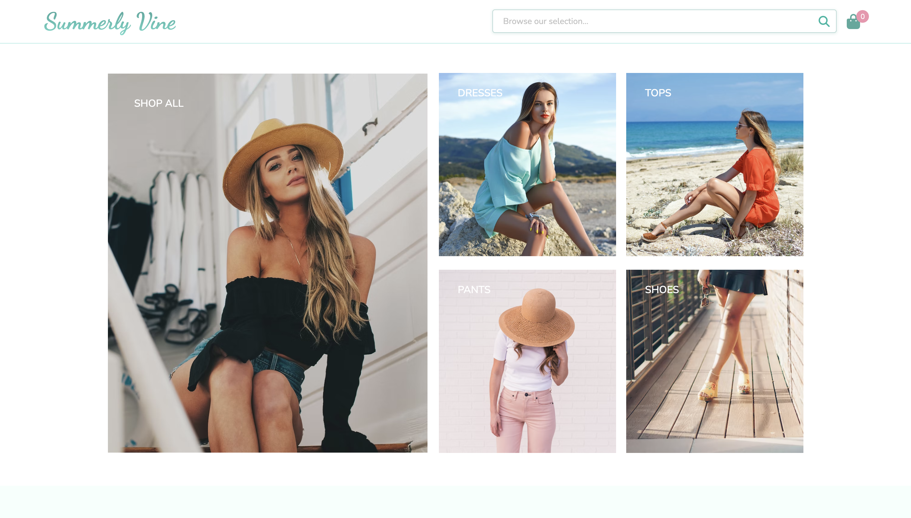

# Summerly Vine

<table>
<tr>
<td align="center">
  This is a project that I designed and developed using the Searchspring API. The search features allows for ther User to search clothing, shoes, accessories, and more. The website is also fully responsive.
</td>
</tr>
</table>

## Demo

Here is a live demo : https://summerlyvine.netlify.app/

## Technologies

- HTML
- CSS
- JavaScript

## Features

- Implements the Search API.
- Uses Fetch API and Async/Await to make HTTP Requests to the Search API.
- Search bar with search button to allow for custom user input.
- "Add to cart" functionality that allows the User to add items to their shopping cart.
- Responsive website.

## Credits

The following are credits to some visual inspiration, ideas, and guidelines that I used during the development and design of this project.

- alexandrahamner and her website Shopily: https://shopily.netlify.app/index.htmlas 
- alexandrahamner again, for her wonderfully constructed README file, which helped me to structure and organize my own.
- Searchspring search page application: http://try.searchspring.com/search?q=jeans
- Tamara Bellis and Jon Ly for their images on https://unsplash.com/

